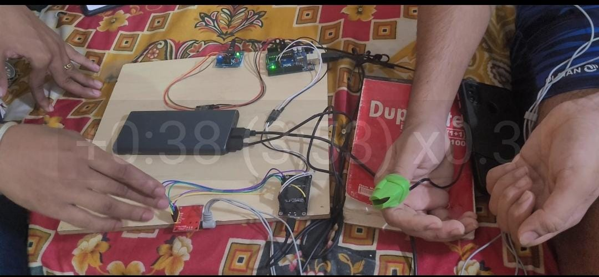

Screenshot | Video Demonstration
---|---
 | 

# THE SENSORS WE HAVE Used:
# This code has been superseded
# Please use our new [PulseSensor Playground Library](https://github.com/WorldFamousElectronics/PulseSensorPlayground)

## Getting Advanced Code / <a href="http://www.pulsesensor.com">PulseSensor</a>  & <a href="http://arduino.cc/"> "Arduino"</a> 
* Blinks LED on Pin 13 to a User's Live Heartbeat.   
* "Fancy Fade Blink" an LED on Pin 5, to a User's Live HeartBeat.
* Calculates User's BPM, Beat-Per-Minute. 
* Calculates User's IBI, the Interval Between Beats.  
* Serial.print's the Signal, BPM, and IBI.  Use this output for our <a href="https://github.com/WorldFamousElectronics/PulseSensor_Amped_Processing_Visualizer">Processing Visualizer App</a> , our <a href="https://itunes.apple.com/us/app/pulse-sensor/id974284569?ls=1&mt=12"> Pulse Sensor Mac App</a>, or your project!  
* Tech Note:  Employ's Arduino's Interrupt, to keep "time", and calculate BPM and IBI.

## Screen Shot
 

## Installing
1. Click the `Clone or Download` button above and download the zip, or if you are a github user, clone this repo, or fork it! 
2. Take the **PulseSensor_Amped_Arduino-master.zip** file, and move it to your **Documents/Arduino** folder.
3. **Unzip** PulseSensor_Amped_Arduino-master.zip in your **Documents/Arduino** folder. **This properly installs your files.**
4. Double-click on **PulseSensorAmped_Arduino_1.5.0.ino** 

	**Or,** 0pen project in **Arduino via *File > Sketchbook > PulseSensor_Amped_Arduino-Master > PulseSensorAmped_Arduino_1.5.0.ino**
 

## Pulse Sensor Hook-up
Arduino Pin   | PulseSensor Cable Color
------------- | -------------
RED           | 5V or 3V   
BLACK         | GND (GROUND)
PURPLE        | A0 (Analog Pin Zero)

## Variables to Note
Variable Name     | What it does
------------------| -------------
Signal            | **Int** that holds raw Analog Input data on **Pin 0**, the PulseSensor's **Purple Cable**. It's updated every 2mS
BPM               | **Int** that holds the **heart-rate value**, derived every beat, from averaging **previous 10 IBI values** 
IBI               | **Int** that holds the **time interval between beats**
Pulse             | **Boolean** that is **true when a heartbeat is sensed**. It's **false** other times.  It **controls LED Pin 13**.
QS                | **Boolean** that is **true whenever Pulse is found and BPM** is updated. User must reset. 

## Working with other Apps via Serial.print
This Arduino Sketch works with:

* Our **Processing Sketch** <a href="https://github.com/WorldFamousElectronics/PulseSensor_Amped_Processing_Visualizer"> "Processing Visualizer"</a>
*  Our **Pulse Sensor Mac App** <a href="https://itunes.apple.com/us/app/pulse-sensor/id974284569?ls=1&mt=12"> "Pulse Sensor Mac App"</a>
*  The **Arduino Serial Plotter**

Follow the links above to learn more about the Processing Visualizer and Mac App. This Read Me will cover how to view your pulse wave and other data with the Arduino Serial Plotter. There is a variable in the Pulse Sensor Amped Arduino Sketch that determines how the serial output is formatted. The variable is called `outputType`, and there are two options for setting this variable: `PROCESSING_VISUALIZER` and `SERIAL_PLOTTER`. By default, `outputType` is set to `SERIAL_PLOTTER`. 

If you want to use the Serial Plotter, upload the Sketch to your Arduino microcontroller, and then select `Tools > Serial Plotter`.

When you turn on the Plotter, make sure that the baud rate is set to 115200. Make this adjustment with the lower right corner menu selector. You will see three traces in the Arduino Serial Plotter. The **red** trace is your pulse wave data from the `Signal` variable. The **yellow** trace is your `IBI`, or the time between each beat. The **blue** trace is your `BPM` or your Beats Per Minute. 

If you only want to see the pulse wave `Signal` data, then you can edit the Arduino Sketch. In the `AllSerialHandling.ino` tab, simply comment out the lines shown below by inserting `//` in the beginning of the line.

Now, when you run the Serial Plotter, you will see a **blue** pulse waveform only!

## Timer Interrupt Notes or "Why did some of PWM Pins stop working ???"
There is a tab in the Arduino code called `Timer_Interrupt_Notes`. This page describes how to set up the timed interrupt depending on which hardware you are using, and what other things you may want to do with your sketch. We are using a hardware timer on the micrcontroller to make sure that our Pulse Sensor samples are taken at a consistent rate. That makes our data extra scientific! Please read it carefully!

PWM on pins 3 and 11 will not work when using this code, because we are using Timer 2!
🤷‍♂️🤷‍♀️  

Interrupt Setting | Disables PWM ON Arduino PINS 
----------------- | -------------
TIMER2            |  3 AND 11  

## Pulse Sensor Preparation [ Garbage In ~ Garbage Out ]
It's important to protect the Pulse Sensor from the oils and sweat that your fingertips and earlobes and other body parts make. That stuff can adversely affect the signal quality. Also, it's important to protect **you** from the electricity that makes the Pulse Sensor work! To this end, we have provided clear vinyl stickers that fit perfectly on the face of the Pulse Sensor. Peel one off, and press it firmly on the **front** side of your Pulse Sensor.

## Troubleshooting
Having trouble making heads or tails of what is wrong?  
Check your raw signal with this project:
<a href="https://github.com/WorldFamousElectronics/PulseSensorStarterProject">WorldFamousElectronics/PulseSensorStarterProject</a> 

Has pullups on the Vdd (1.8V) line. To make it work, the three 4k7 pullups must be
desoldered and external 4.7k pullups to Vcc of the MCU must be added.

# *****************************************************************

# Arduino-AD8232|Sound Card ECG

The **Sound Card ECG** program provides a simple interface to view and measure ECG signals obtained through the sound card (using a line-in or microphone jack).

### Download
A click-to-run EXE is available: **[SoundCardECG.zip](https://raw.githubusercontent.com/swharden/SoundCardECG/master/download/SoundCardECG.zip)** (version 1.5)

### Hardware Notes

Notes | Image
---|---
**AD8232 ECG Module**: My preferred ECG device (and the one I used in the screenshot) is a [AD8232](https://www.analog.com/media/en/technical-documentation/data-sheets/ad8232.pdf) breakout board ([SparkFun](https://www.sparkfun.com/products/12650)) feeding the signal directly into the microphone jack of my PC. | 
**Lead Placement**: The AD8232 works best if leads are placed in one of these configurations | 
**DIY ECG with 1 Op-Amp**: Those interested in building an ECG circuit from scratch may find my [DIY ECG with a Single Op-Amp](https://github.com/swharden/diyECG-1opAmp) (an LM-741) project interesting. | 
# ------------------------------------------------------------------------------
# MICROPROCESSORS USED:

  

	

Arduino is an open-source physical computing platform based on a simple I/O
board and a development environment that implements the Processing/Wiring
language. Arduino can be used to develop stand-alone interactive objects or
can be connected to software on your computer (e.g. Flash, Processing and MaxMSP).
The boards can be assembled by hand or purchased preassembled; the open-source
IDE can be downloaded for free at [https://arduino.cc](https://www.arduino.cc/en/Main/Software)

## More info at

-  [Our website](https://www.arduino.cc/)

-  [The forums](https://forum.arduino.cc/)

-  Follow us on [Twitter](https://twitter.com/arduino)
-  And like us at [Facebook](https://www.facebook.com/official.arduino)

## Bug reports and technical discussions

-  To report a *bug* in the software or to request *a simple enhancement* go to [Github Issues](https://github.com/arduino/Arduino/issues)

-  More complex requests and technical discussion should go on the [Arduino Developers
mailing list](https://groups.google.com/a/arduino.cc/forum/#!forum/developers)

-  If you're interested in modifying or extending the Arduino software, we strongly
suggest discussing your ideas on the
[Developers mailing list](https://groups.google.com/a/arduino.cc/forum/#!forum/developers)
 *before* starting to work on them.
That way you can coordinate with the Arduino Team and others,
giving your work a higher chance of being integrated into the official release

### Security

If you think you found a vulnerability or other security-related bug in this project, please read our
[security policy](https://github.com/arduino/Arduino/security/policy) and report the bug to our Security Team 🛡️
Thank you!

e-mail contact: security@arduino.cc

## Installation

Detailed instructions for installation in popular operating systems can be found at:

-  [Linux](https://www.arduino.cc/en/Guide/Linux) (see also the [Arduino playground](https://playground.arduino.cc/Learning/Linux))
-  [macOS](https://www.arduino.cc/en/Guide/macOS)
-  [Windows](https://www.arduino.cc/en/Guide/Windows)

## Contents of this repository

This repository contains just the code for the Arduino IDE itself.
Originally, it also contained the AVR and SAM Arduino core and libraries
(i.e.  the code that is compiled as part of a sketch and runs on the
actual Arduino device), but those have been moved into their own
repositories.  They are still automatically downloaded as part of the
build process and included in built releases, though.

The repositories for these extra parts can be found here:
-   Non-core specific Libraries are listed under: <https://github.com/arduino-libraries/>
    (and also a few other places, see `build/build.xml`).

-   The AVR core can be found at: <https://github.com/arduino/ArduinoCore-avr>

-   Other cores are not included by default but installed through the
    board manager. Their repositories can also be found under
    <https://github.com/arduino/>.

## Building and testing

Instructions for building the IDE and running unit tests can be found on
the wiki:
-   <https://github.com/arduino/Arduino/wiki/Building-Arduino>
-   <https://github.com/arduino/Arduino/wiki/Testing-Arduino>

## Credits

Arduino is an open source project, supported by many.

The Arduino team is composed of Massimo Banzi, David Cuartielles, Tom Igoe
and David A. Mellis.

Arduino uses
[GNU avr-gcc toolchain](https://gcc.gnu.org/wiki/avr-gcc),
[GCC ARM Embedded toolchain](https://launchpad.net/gcc-arm-embedded),
[avr-libc](https://www.nongnu.org/avr-libc/),
[avrdude](https://www.nongnu.org/avrdude/),
[bossac](http://www.shumatech.com/web/products/bossa),
[openOCD](http://openocd.org/)
and code from [Processing](https://www.processing.org)
and [Wiring](http://wiring.org.co).

Icon and about image designed by [ToDo](https://www.todo.to.it/)

# *****************************************************************
# ESP8266
 
Documentation and help with the ESP8266 chip/boards/modules. 

You can find the entire article [here](https://tttapa.github.io/ESP8266/Chap01%20-%20ESP8266.html), or you can just download it.
